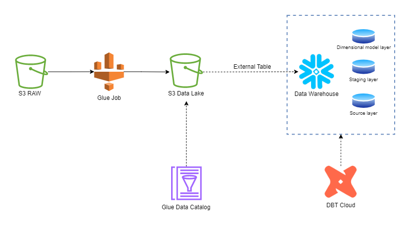

# Summary

This repository contains code for Door2Door company Data Lake and Data Warehouse projects.
Contents:
- AWS Glue Job Data Lake loader script (/glue).
- DBT code for Data Warehouse management (/dbt).
- AWS infrastructure Terraform code (/terraform).

 

# Infrastructure Overview

 

 

Schema above gives an overview of data flow between the source and the Data Warehouse.
Here is an explanation of each step in the flowchart:

 

## AWS S3 Bucket - RAW

 

This S3 bucket is the landing zone for JSON files containing IOT events on the location of the Vehicles used by Door2Door.

More explanation on the file contents can be found in assets/DE_Tech_Assessment_Metadata (1)[11460].pdf

Bucket is publicly accessible and data can be reached on S3 location: s3://de-tech-assessment-2022

 

## AWS Glue

 

Data is moved from RAW S3 bucket to the Data Lake using AWS Glue Job. 

Glue script is written in Python and accepts **--date** as a parameter. It copies data for all files who's prefix starts with specified date.

Files are merged into a single Parquet file and stored into Data Lake S3 bucket.

The format of the output bucket is defined in the Data Catalog and the associated table is partitioned by date.

A Glue trigger which executes the Job with yesterday's date as a parameter which creates a new partition in the Data Lake and copies new data.

Parameter | Description | Mandatory | Default Value
--- | --- | --- | --- | 
--date | Date by which input data will be filtered | false | yesterdays date in format of '2019-06-01'
--input_bucket | Name of the input bucket | true | -
--input_bucket_key | Name of the folder where input files are stored | true | -
--output_datacatalog_database | Name of the output Data Catalog database | true | -
--output_datacatalog_table| Name of the output Data Catalog table | true | -

 

## AWS S3 Bucket - Data Lake

 

Data in Data Lake resides in "door2door-datalake" bucket in "vehicle_iot_data/" folder. 

It us partitioned by date. For each data a folder is created with name in format of "date=2019-06-01/".

 

## Snowflake

 

Snowflake is used as a Data Warehouse database.

Data from the Data Lake is not directly imported into the Data Warehouse. Instead a **STAGE** and **EXTERNAL TABLE** were created to make data available in Snowflake in unstructured format. Table holds a single field called "VALUE" of type VARIANT which contains the JSON representation of the records in the Data Lake. 

External table VEHICLE_IOT_DATA resides in DOOR2DOOR_DWH database in RAW schema.

To establish the integration between Snowflake and S3 this Guide was followed with all necessary resources created on both sides: https://docs.snowflake.com/en/user-guide/data-load-s3-config-storage-integration.html

 

## DBT Cloud

 

DBT is used to define and build the tables in the Snowflake Data Warehouse based on the principles of dimensional modeling. There are the layers of tables with different purposes:
- Source - this layer consists of the external table in RAW schema already explained above.
- Staging - this layer contains data fetched from Source layer with basic transformations applied to clean the data, unwrap from variant format, enrich and prepare for the next stage.
- Dimensional model - this layer fetches data from Staging layer and models them into Fact and Dimension tables.

DBT code is deployed on DBT cloud where it is scheduled to refresh the tables once a day.

Table definition and relations are explained in more detail in DBT documentation: https://cloud.getdbt.com/accounts/12852/jobs/209477/docs/#!/overview

 

 

## Terraform

 

Terraform is used to deploy services in AWS. Most of the infrastructure is included in the scripts, except Data Lake bucket and the catalog which were previously manually integrated with Snowflake so rebuilding this would be time-consuming.